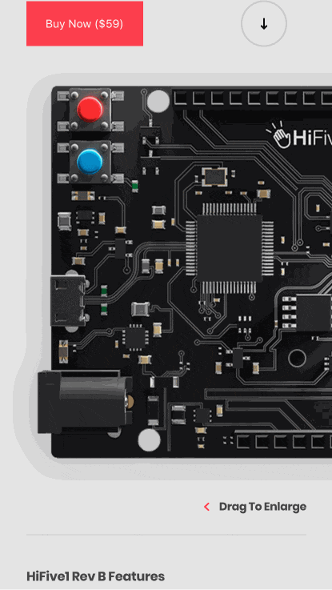

# enhanced-framer-motion

> 修炼 framer-motion

## 01 level up

## 02 swipe-to-enlarge

## 预览

[https://hifive.yna.app/](https://hifive.yna.app/)



### 结构

```js
function App() {
  return (
    <>
      <Header />
      <Breadcrumb />
      <Product />
      <Spec />
    </>
  );
}
```

- Header
  - 最外层 .header 是个 div 不需要设 width，设个高度即可
  - 内层盒子用 flex 的 align-item 居中，设下高度 100%
  - 最内层盒子 flex 的往两边排布，设下宽度 100% 撑开

```scss
.header {
  height: 72px;
  .header-inner {
    padding: 0 32px;
    display: flex;
    align-items: center;
    height: 100%;
    .header-content {
      display: flex;
      justify-content: space-between;
      align-items: center;
      width: 100%;
      .logo {
        position: relative;
        width: 85px;
        display: flex;
        align-items: center;
        img {
          width: 85px;
        }
      }
    }
  }
}
```

- Product 的结构
  - 产品图上方部分为产品描述
  - 产品图部分
  - 产品图下方部分为产品参数
- 产品图为核心部分，其又依次分为：
  1. background 遮盖层
  2. drag-header 预览时的头部
  3. 真正的产品图
  4. product-drag 预览时的尾部(含进度条)

```js
const Product = () => {
  return (
    <div className="product">
      <div className="product-inner">
        <div className="product-content">
          <div className="product-content-inner">
            {/* some desc... */}
            <div className="btn-row">
              <button>Buy Now ($59)</button>
              <DownArrow />
            </div>
          </div>
        </div>
      </div>
      <div className="product-slide-enlarge">
        <div className="background"></div>
        <div className="product-drag-header">
          <div className="company-name">HiFive1</div>
          <div className="close">
            <Close />
          </div>
        </div>
        <div className="product-container">
          <div className="product-image">
            
          </div>
        </div>
        <div className="product-drag">
          <div className="product-drag-inner">
            <div className="product-drag-label">{/* preview header */}</div>
            <div className="product-drag-progress-background">
              <div className="product-drag-progress"></div>
            </div>
          </div>
        </div>
      </div>
    </div>
  );
};
```

### 步骤

- 产品图允许水平滑动浏览
  - `drag={'x'}` 仅允许 x 轴
  - `dragConstraints={{ left: -1060, right: 0 }}` 活动范围
  - `dragElastic={0.05}` 拖拽的灵活度，相当于在 x 轴上到了限值后的偏差(到了限值再多动一点的意思)

```js
<motion.div
  drag={'x'}
  dragConstraints={{ left: -1060, right: 0 }}
  dragElastic={0.05}
  className="product-image"
>
  
</motion.div>
```

- 跟随进度条

```js
const width = useTransform(x, [-1060, 0], [350, 0]);

// --------

<div className="product-container">
  <motion.div
    style={{ x }}
    drag={'x'}
    dragConstraints={{ left: -1060, right: 0 }}
    dragElastic={0.05}
    className="product-image"
  >
    
  </motion.div>
</div>

<div className="product-drag-progress-background">
  <motion.div style={{ width }} className="product-drag-progress"></motion.div>
</div>;
```

- 优化动画

```js
const ease = [0.6, 0.05, -0.01, 0.99];
const x = useSpring(0, { stiffness: 300, damping: 200, ease: ease });
```

- 拖动产品图放大效果
  - `useTransform(x, [-100, 0], [1.25, 1])`
  - 观察 x 的值变化，在 -100 (px)时对应 1.25 倍放大
  - 在 0 (px)时又还原 1 倍的大小

```js
const scale = useTransform(x, [-100, 0], [1.25, 1]);

<motion.div style={{ x, scale }} />;
```

- 检测拖拽预览的状态

> 埋个点：为了以后点击 ❌ 关闭预览

```js
// state
const [state, setState] = useState(false);

useEffect(() => {
  // 给 x 对象上个回调，监视它是否在 x 轴移动超过 -100 px
  x.onChange(() => {
    x.get() > -100 ? setState(false) : setState(true);
  });
  // 这里不需要每次都监视，因为本来设置的就是回调监听函数！
  // eslint-disable-next-line
}, []);
```

- 拖拽遮盖层背景 FadeIn

```js
const fadeIn = useTransform(x, [-100, 0], [1, 0]);

<motion.div style={{ opacity: fadeIn }} className="background" />;
```

- 拖拽 tips 元素 FadeOut

```js
const fadeOut = useTransform(x, [-60, 0], [0, 1])
<motion.h6 style={{ opacity: fadeOut, x }}>
  <Chevron />
  Drag To Enlarge
</motion.h6>
```

- 产品图上下区域挪开

```js
const up = useTransform(x, [-100, 0], [-100, 0]);
const down = useTransform(x, [-100, 0], [100, 0]);

<motion.div style={{ translateY: up }} className="product-content-inner"/>

// 本来也可以 translateY，但目标在组件意外，就用 padding 实现类似效果
<motion.div style={{ paddingBottom: down }} className="product-drag"/>
```

- 产品拖拽预览标题
  - 注意，这个 header是 fixed
  - 当拖拽了 100px 显示产品预览标题和叉叉
  - 如果有操作从 “dom tree” 上增加删除元素时的动画，要用 AnimatePresence 包一下

> AnimatePresence allows components to animate out when they're removed from the React tree.

```js
{state ? (
  <AnimatePresence>
    <motion.div
      initial={{ opacity: 0, y: -30 }}
      animate={{ opacity: 1, y: 0 }}
      exit={{ opacity: 0, y: -30 }}
      transition={{ ease: ease }}
      className="product-drag-header"
    >
      <div className="company-name">HiFive1</div>
      <div className="close">
        <Close />
      </div>
    </motion.div>
  </AnimatePresence>
) : (
  <AnimatePresence />
)}
```

- 点击关闭商品拖拽预览

```js
const closeProductDrag = () => {
  x.stop();
  x.set(0);
}

<div onClick={closeProductDrag} className="close">
  <Close />
</div>
```

- 预览时禁止上下滚动

```js
 let targetElement = document.querySelector("html");

  useEffect(() => {
    state
    ? targetElement.classList.add('no-scroll')
    : targetElement.classList.remove('no-scroll');
  });
```
